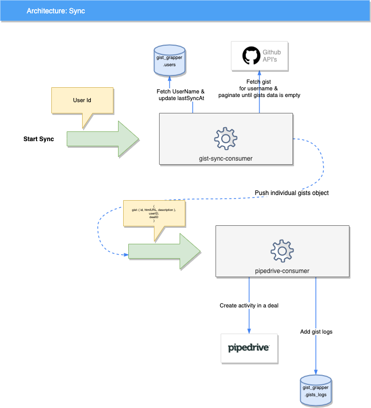
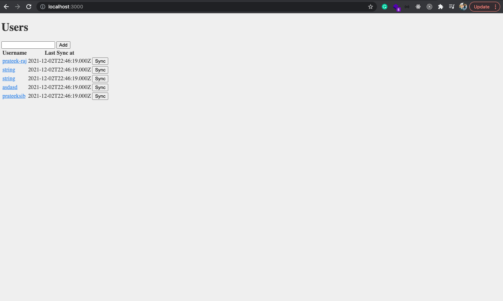
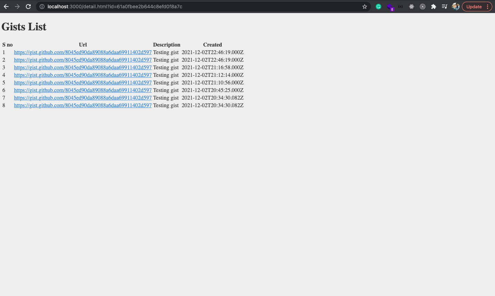

[](https://github.com/prateek-raj/pipedrive-gist-grapper/actions/workflows/ci.yml) [](https://github.com/prateek-raj/pipedrive-gist-grapper/actions/workflows/cd.yml)
<div id="top"></div>

<div align="center">
<h3 align="center">Pipedrive Gist Grapper</h3>

  <p align="center">
    Using the Github API query a user’s publicly available GitHub gists and create a deal/activity in Pipedrive for each gist. Implemented a cron job that periodically checks for a user's publicly available gists, this application also has a web endpoint which provide the gists for that user that were added since the last visit.
    <br />
    <a href="https://github.com/prateek-raj/pipedrive-gist-grapper/issues">Report Bug</a>
  </p>
</div>
<!-- TABLE OF CONTENTS -->
<details>
  <summary>Table of Contents</summary>
  <ol>
    <li>
      <a href="#about-the-project">About The Project</a>
      <ul>
        <li><a href="#services">Services</a></li>
        <li><a href="#built-with">Built With</a></li>
        <li><a href="#infra-platforms">Infra Platforms</a></li>
        <li><a href="#flow-diagram">Flow diagram</a></li>
      </ul>
    </li>
    <li>
      <a href="#getting-started">Getting Started</a>
      <ul>
        <li><a href="#prerequisites">Prerequisites</a></li>
        <li><a href="#installation">Installation</a></li>
      </ul>
    </li>
    <li><a href="#usage">Usage</a></li>
    <li><a href="#rebuild-the-project">Rebuild the project</a></li>
    <li><a href="#Fix-code-style-and-formatting-issues">Fix code style and formatting issues</a></li>
    <li><a href="#others-useful-commands">Other useful commands</a></li>
    <li><a href="#tests">Tests</a></li>
    <li><a href="#contact">Contact</a></li>
  </ol>
</details>


<!-- ABOUT THE PROJECT -->
## About The Project

Using the Github API query a user’s publicly available GitHub gists and create a deal/activity in Pipedrive for each gist. Implemented a cron job that periodically checks for a user's publicly available gists, this application also has a web endpoint which provide the gists for that user that were added since the last visit.



### Services
* *Gist-Sync-Consumer* collects the gist from the github using gist api.
* *Pipedrive-Consumer* save it's logs in db and create an activity on pipedrive on deal associated to the user.
* *Start Sync Producer* is an HTTP route under the hood a producer is running which push messages to Gist-Sync-Consumer.
* *Pipedrive Producer* is a non HTTP producer which is triggered by the gist sync consumer.

<p align="right">(<a href="#top">back to top</a>)</p>

### Built With

* [Loopback 4](https://loopback.io/doc/en/lb4/)

<p align="right">(<a href="#top">back to top</a>)</p>

### Infra Platforms
* AWS ECS, ECR, & CloudWatch
* Github & Github Action
* Docker
* Mongodb
* CloudAMQP

<!-- GETTING STARTED -->
## Getting Started

This is an example of how you may give instructions on setting up your project locally.
To get a local copy up and running follow these simple example steps.

### Assumption

* To process gist for a user, we don't have a definite numbers of gist a user can own. So i used consumer producer concept.

### Prerequisites

This is an example of how to list things you need to use the software and how to install them.
* Install [node js 14.X](https://nodejs.org/en/download/releases/)
* Install latest npm
  ```sh
  npm install npm@latest -g
  ```
* Please generate Github Personal Access token and Pipedrive access respectively and place it in [.env.development](.env.development)

### Installation

1. Clone the repo
   ```sh
   git clone https://github.com/prateek-raj/pipedrive-gist-grapper
   ```
2. Run command to install the dependencies and packages.
   ```sh
   make init-dev
   ```

<p align="right">(<a href="#top">back to top</a>)</p>

<!-- USAGE EXAMPLES -->
## Usage

To run the application, run command:

```sh
  NODE_ENV=development npm start
```

Open http://127.0.0.1:3000 in your browser.





<p align="right">(<a href="#top">back to top</a>)</p>

## Rebuild the project

To incrementally build the project:

```sh
npm run build
```

To force a full build by cleaning up cached artifacts:

```sh
npm run rebuild
```

<p align="right">(<a href="#top">back to top</a>)</p>

## Fix code style and formatting issues

```sh
npm run lint
```

To automatically fix such issues:

```sh
npm run lint:fix
```

<p align="right">(<a href="#top">back to top</a>)</p>

## Other useful commands

- `npm run migrate`: Migrate database schemas for models
- `npm run openapi-spec`: Generate OpenAPI spec into a file
- `npm run docker:build`: Build a Docker image for this application
- `npm run docker:run`: Run this application inside a Docker container

<p align="right">(<a href="#top">back to top</a>)</p>

## Tests

```sh
npm test
```

<p align="right">(<a href="#top">back to top</a>)</p>

<!-- CONTACT -->
## Contact

Prateek Raj - [@twitter_handle](https://twitter.com/_raj_prateek) - r.prateek11@gmail.com

<p align="right">(<a href="#top">back to top</a>)</p>
